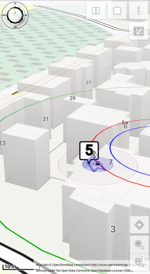

# Logging UUID 0xFD6F

## GPSLogger II 
Mit der aktuellsten Version der App GPSLogger (ab v2.0.0.116) ist es möglich die empfangenen Informationen (Zeit & Ort)
zu speichern. Die App die seit über 10 Jahren immer wieder weiter entwicklet wird, hat natürlich noch eine vielzahl von
Funktionen mehr - aber wenn man nicht nur wissen möchte, wieviele BluetoothLE Beacons aktuell um einen herum ein
_Exposure Notification_ Signal senden, sondern diese Information in reklation zu Zeit und Ort stehen möchte, dann ist
dies über diese App möglich.

Der GPSLogger II ist natürlich auch kostenfrei und enthält keine Werbung

## Download
Die App ist kostenlos & ohne Werbung im GoolePlayStore verfügbar -
https://play.google.com/store/apps/details?id=com.emacberry.gpslogger

## Logging verwenden
Zunächst muss man in den Einstellungen der App das Aufzeichnen der BluetoothLE Beacons mit der UUID 0xFD6F aktivieren.
Hierzu startet man die app, öffnet das Menu und wächlt den Menüpunkt 'Einstellungen'. Aus der Liste von Optionen wählt
man den obersten Punkt 'Allgemeine Einstellungen...'. Zuletzt muss der Schalter 'UUID 0xFD6F Beacon Scanner' aktiviert
werden. (Diese Einstellung muss natürlich nur einmal erfolgen.)

Um Ihr System nicht unnötig zu belasten, sollten der 'UUID GPSLogger II Scann Dienst' und der 'UUID 0xFD6F Tracer' nicht
gleichzeitig laufen - es schadet aber auch nicht wirklich.

Sobald der Scanner in den Einstellunge aktiviert wurde, kann die Aufzeichnung über den 'REC' Button in der Hauptleiste
gestartet werden... Nach einer kurzen Zeit sollten alle Beacons der Umgebung angezeigt werden. Bitte beachten, dass die
Beacons regelmäßig Ihrer Adresse ändern und deswegen als neuer Beacon erkannt werden.

## Zählweise
Im Gegensatz zum 'UUID 0xFD6D Tracer' zählt der GPSLogger aktuell nicht die "aktiven" Beacons in der Umgebung - sondern
zählt die eindeutigen IDs. Man stelle sich das folgende Scenario vor:

Man selbst steht an einem festen Ort und es man begegnet immer wieder einer Person die ein Beacon gestartet hat. In
diesem Fall zeigt der 'UUID 0xFD6D Tracer' einem immer wieder '0' oder '1' an. Der GPSLogger II hingegen zählt jeden
einzeln Beacon dem man begegnet ist - also wenn 10 Beacons an einem vorbei gehen, dann wird in der GPSLogger II App auch
die Ziffer 10 angezeigt (an diesem Ort sind einem in Summe 10 Beacon ID's begegnet).

Ist man Stationär und es begegnen einem 10 unterschiedliche Beacons zur gleichen Zeit, zeigt der 'UUID 0xFD6D Tracer' 10
Active Sender und auch der GPSLogger wird einem die Zahl 10 anzeigen.

Nun ist das besondere Merkmal des Exposure Notification Frameworks, dass sich die Adresse des Beacons regelmäßig ändert 
(meiner bisherigen Erfahrung nach so alle 2 min) - Diese Adress-Änderung kann von keinem System von einem neuen Beacon
unterschieden werden - es ist als nicht feststellbar, dass diese Neue-ID von dem gleichen Mobiltelefon aus gesendet wird
oder aber sich ein neues Mobiltelefon in die Empfangsweite eingedrungen ist (dies ist ein echtes Privacy-Feature). 

Dem UUID 0xFD6D Tracer ist dieser Umstand "egal" - ein Beacon ist verschwunden - ein neues ist hinzugekommen - die Summe
der Sender bleibt gleich. Anders in der Anzeige im GPSLogger - hier wird je neuer Adresse/Beacon der Zähler erhöht.

[//]: # (### Besonderheit im GPSLogger II)
[//]: # (Aktuell ist die Implementierung so, dass der Scanner jede neue Adresse nur genau einmal [wie sie das erste mal im Scann auftaucht] meldet. Startet man die Aufzeichnung nachdem ein Beacon bereits vom Scanner erfasst wurde, so bekommt man auf der Karte für diese Beacon Adresse kein Symbol angezeigt - erst wenn das Beacon das nächste mal seine Adresse ändert, erscheint das Beacon auch auf der Karte. Dies kann den Eindruck erwecken, dass die Erkennung eines neuen Beacons länger dauern kann - dem ist nicht so. Sobald ein neues Beacon in Reichweite ist, wird es vom Scanner erfasst - die neue ID gemeldet und es erfolgt die Anzeige auf der Karte. Derzeit läßt das App-Design es nicht zu den im Hintergrund laufenden Scanner beim Start einer Aufzeichnung komplett zurückzusetzen [da muss ich nochmal in mich gehen].)
[//]: # (Zusammenfassend - Nach dem Start der Aufzeichnung kann es im ungünstigsten Fall bis zu zwei Minuten dauern bis ein Beacon [das sich schon vor dem Start der Aufzeichnung erfasst wurde] angezeigt wird. Neue Beacons werden sofort angezeigt.)